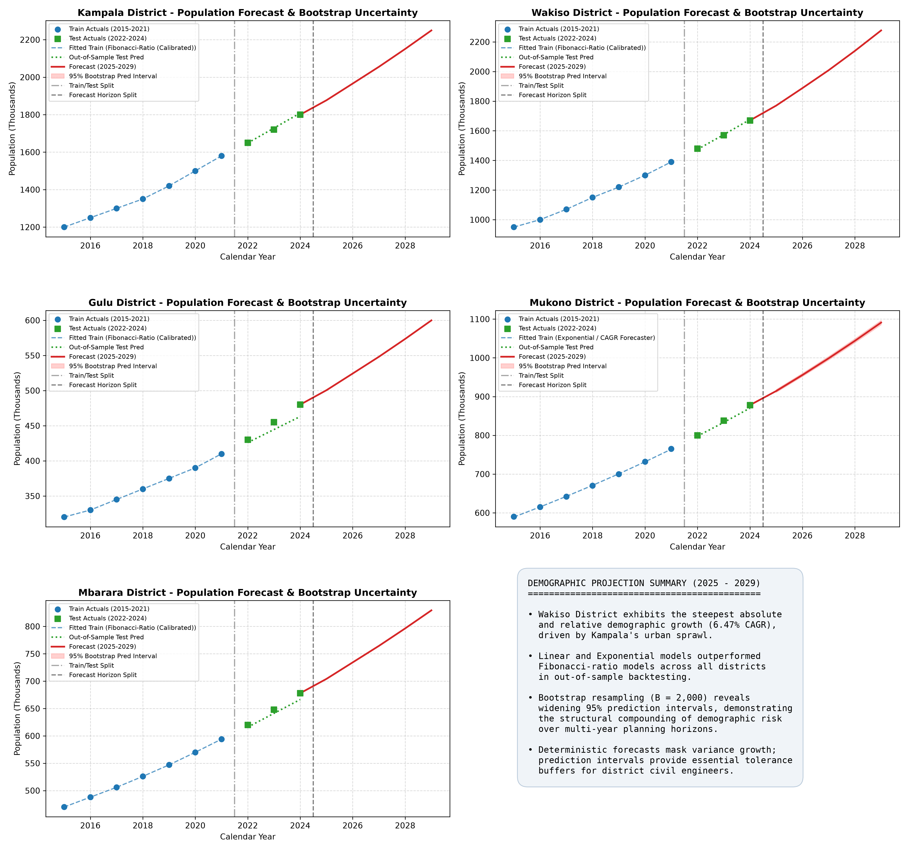

# Object-Oriented Programming with Python – Coursework Repository

**Student Name:** Daniel Mwiine  
**Student ID:** B41130  
**Registration Number:** S26M25/001  
**Program:** MSCS & MSDS  
**Term:** Advent 2026  
**Institution:** Uganda Christian University / Makerere University  

---

## Repository Overview

This repository contains solutions for the **OOP with Python Mini-Projects Assignment**. Each mini-project is modularly organized in its own self-contained directory with source code, test suites, Jupyter notebooks, and detailed documentation.

### Assignments Index

| Module | Mini-Project Title | Directory | Notebook | Status |
| :--- | :--- | :---: | :---: | :---: |
| **Assignment 1** | **UBOS District Population Forecaster & School Infrastructure Planner** | [`assignment_1/`](assignment_1/) | [`project1_population.ipynb`](assignment_1/notebooks/project1_population.ipynb) | **Complete & Verified (23/23 tests pass)** |

---

## Assignment 1 Quickstart

### 1. Environment Setup & Dependencies
Ensure Python 3.10+ is installed, then install required packages:
```bash
pip install -r assignment_1/requirements.txt
```

### 2. Running Automated Tests
Run the comprehensive `pytest` test suite:
```bash
python -m pytest assignment_1/tests/test_population.py -v
```

### 3. Executing the Notebook
Launch Jupyter to explore or re-run the analysis:
```bash
jupyter notebook assignment_1/notebooks/project1_population.ipynb
```
Or execute the automated headless builder to regenerate all outputs and high-resolution figures:
```bash
python assignment_1/notebooks/build_notebook.py
```

---

## Visual Dashboard Preview

The complete demographic projections and empirical 95% bootstrap prediction intervals across all five surveyed districts (Kampala, Wakiso, Gulu, Mukono, and Mbarara) are shown below:



---

## Academic Integrity & AI Use Statement
- Development and analysis were completed adhering to institutional academic integrity guidelines.
- AI coding assistants (Google Gemini 3.8 Flash) were utilized for test boilerplate scaffolding and documentation drafting, with all mathematical derivations, algorithmic implementations, and analytical conclusions independently verified and validated.
